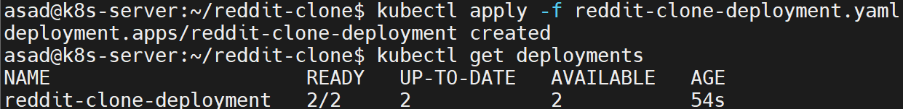

# Reddit Clone App on Kubernetes with Ingress
This project demonstrates how to deploy a Reddit clone app on Kubernetes with Ingress.

## App Credit
This application is developed by [Shadee Merhi](https://github.com/shadeemerhi), and complete code of the application can be seen at [reddit-clone-yt](https://github.com/shadeemerhi/reddit-clone-yt.git). 
 

## Prerequisites
To deploy the application on Kubernetes, one should have the following tools installed on the machine (local or remote vm): 

- Docker
- Kubernetes/Minikube cluster (Running)
- kubectl
- Git

# App Deployment Steps on K8s  
Following are the steps to deploy the Reddit Clone App on Kubernetes/Minikube cluster: 

## Step 1: Clone the App Code 
Clone the application code to the machine. 

`git clone https://gitlab.com/asadhanif3188/devops-project-reddit-clone-app-kubernetes-with-ingress.git`

## Step 2: Dockerfile 
Add a Dockerfile, in case it is not already added. 

```
FROM node:19-alpine3.15

WORKDIR /reddit-clone

COPY . /reddit-clone
RUN npm install 

EXPOSE 3000

CMD ["npm","run","dev"]
```

## Step 3: Build Image 
To execute the Reddit Clone App, a Docker image is built from Dockerfile using following command.

`docker build -t asadhanif3188/redditclone:v1 .`


## Step 4: Push the Docker Image To DockerHub
Now push this Docker Image to DockerHub so our Deployment file can pull the image and run the app in Kubernetes pods.

 * First login to DockerHub account using Command i.e `docker login` and give your username & password.
 * Then use `docker push asadhanif3188/redditclone:v1` for pushing to the DockerHub.

**Note:** This step is optional, in case you have built the Docker image on the same machine. If K8s/Minikube is running on anyother machine then image need be downloaded from DockerHub.  


## Step 4: Deploy the app to Kubernetes
It is time to start the real game, by deploying the Reddit Clone App on K8s cluster with the help of **Deployment manifest** file. 

### Step 4 (a): Create a Deployment File
Let's Create a Deployment file, i.e. `reddit-clone-deployment.yaml`, for our Application. Use the following code for the *reddit-clone-deployment.yaml* file:

```
apiVersion: apps/v1
kind: Deployment
metadata:
  name: reddit-clone-deployment
  labels:
    app: reddit-clone
spec:
  replicas: 2
  selector:
    matchLabels:
      app: reddit-clone
  template:
    metadata:
      labels:
        app: reddit-clone
    spec:
      containers:
      - name: reddit-clone
        image: asadhanif3188/redditclone:v1
        ports:
        - containerPort: 3000
```

### Step 4 (b): Apply Deployment File
Once deployment file is ready, it is time to apply this file to create resources like Deployment, ReplicaSet and Pods. To create the resources, execute the following command.

`kubectl apply -f reddit-clone-deployment.yaml`



## Step 5: Expose the app as a Service 
Once the Pods are running under a deployment, the application can be accessed internally. But we want to make the app accessible from outside the cluster. So we need to create a service to expose the app. 

### Step 5 (a): Create a Service File
Let's Create a Service file, i.e. `reddit-clone-service.yaml`, for our Application. Use the following code for the *reddit-clone-service.yaml* file:

```
apiVersion: v1
kind: Service
metadata:
  name: reddit-clone-service
  labels:
    app: reddit-clone
spec:
  selector:
    app: reddit-clone
  ports:
    - name: http
      protocol: TCP
      port: 30000
      targetPort: 30000
  type: ClusterIP
```

### Step 5 (b): Apply Service File
To create the service, execute the following command.

`kubectl apply -f reddit-clone-service.yaml`


